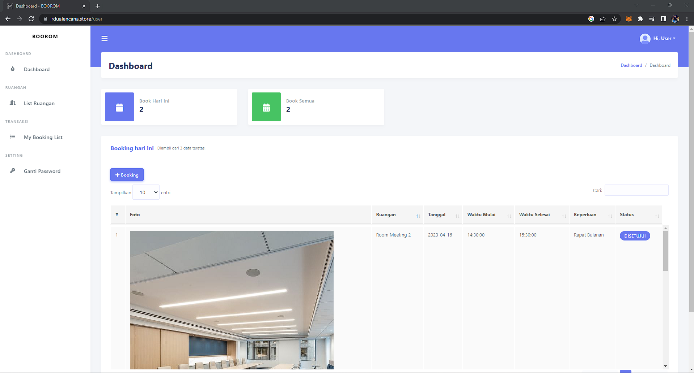

<h1 align="center">
    Aplikasi Booking Room Meeting
</h1>

<p>
    Fitur Aplikasi
</p>

Admin :
- Melakukan login
- Menambah, mengedit, menghapus data ruangan
- Menambah, mengedit, menghapus data user
- Menolak atau menyetujui order dari user
- Mengganti Password

User :
- Melakukan login
- Melakukan order ruangan
- Mengganti Password

## Akun :
Admin :
- username : admin
- password : admin

User : 
- username : user
- password : user

# Demo Aplikasi :

<h3>1. Landing Page</h3>


<h3>2. Login Page</h3>


<h3>3. Admin Dashboard</h3>


<h3>4. Admin Data Ruangan</h3>


<h3>5. Admin User Management</h3>


<h3>6. Admin Booking List</h3>


<h3>7. User Dashboard</h3>



<h3>8. User Booking</h3>


### Instalasi
- Clone atau Download 
- Masuk ke folder BOOROM ini
- Jalankan di terminal `composer install`
- Copy .env.example ke .env (Jika tidak ada .env silakan buat di root folder)
- Sesuaikan konfigurasi .env seperti username dan password database dengan milikmu
- Jalankan `php artisan key:generate` untuk generate `APP_KEY` di .env
- Buat database MySQL dengan konfigurasi .env
- Jalankan di terminal `php artisan migrate --seed`

### Jalankan Aplikasi
```
php artisan serve
```

### Tech Stack
- Laravel 8
- Bootstrap 4
lain-lain:
- Yajra Datatables
- Stisla Admin Theme
